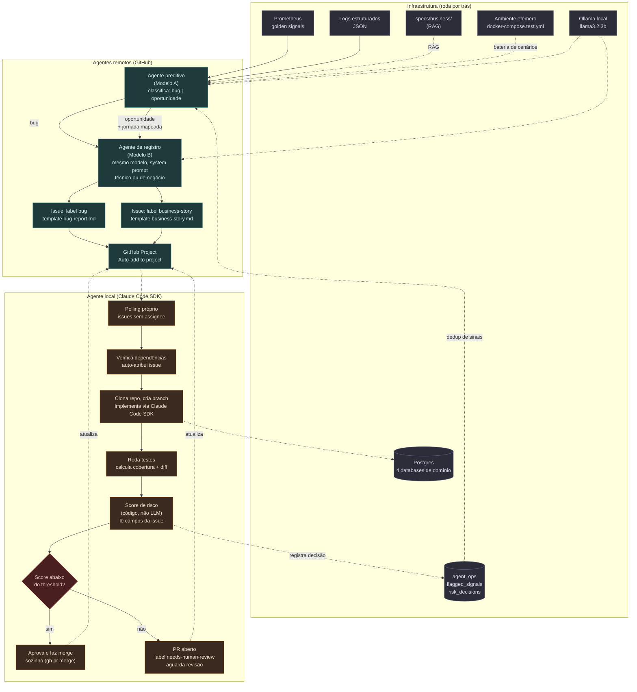

# Escopo de estudo: simulação de domínio PIX + caos + engenharia agêntica

## Histórico de decisões

- **v1**: escopo inicial com as três camadas (domínio, caos, agentes) e arquitetura em diagrama
- **v2**: fraude estendida para onboarding/conta (além de transação); execução local com Postgres; comunicação REST exigindo arquitetura de domínio explícita; observabilidade de engenharia via Grafana (golden signals); monitoramento dos agentes via log estruturado; repositório monorepo desacoplável
- **v3**: stack fechada em Python/FastAPI; geradores de fraude simples agora, evoluindo depois; agente preditivo sem RAG por enquanto, em repositório separado de um projeto anterior
- **v4**: volumetria de dados definida — 500k+ contas, 20-50 transações/conta, percentuais realistas de fraude (0,5-1% onboarding, 1-2% transação), 5-10% de falhas técnicas
- **v5**: score de risco de subida desenhado — criticidade do serviço (peso maior, tier fixo por serviço), categoria da mudança como modulador (regra de negócio vs. operacional), cobertura de teste e tamanho de diff como sinais secundários, threshold de autonomia variando por criticidade
- **v6**: contratos REST dos quatro serviços definidos; arquitetura de comunicação passa a combinar REST (síncrono) com Kafka (eventos assíncronos de onboarding); fluxo de reprovação separado em duas filas — revisão de qualidade (com retentativa) e revisão de compliance/fraude (sem retentativa, análise direta)
- **v7**: fluxos futuros de CRUD completo registrados (cancelamento de conta, cancelamento de chave, estorno de transação) — não implementados agora, mas considerados no desenho do modelo de dados desde já para evitar migração de schema depois
- **v8**: uso do board GitHub Projects antecipado para a Fase 1 — mecanismo de consumo de issues (Claude Code) separado de quem povoa o board (humano agora, agente preditivo depois)
- **v9**: abordagem spec-driven adotada — spec de negócio por história, specs técnicas transversais (stack, logging, database, error-handling, api-conventions, testing, observability, messaging, security, infrastructure)
- **v10**: varredura de lacunas entre documento de escopo original e specs de negócio geradas (06, 07, 08). Débito técnico registrado: `account-service` gera risco só por herança do onboarding, sem sinais próprios (ex. `padrao_mula` na abertura de conta) — mantido como simplificação intencional por ora, revisitar depois. Soft delete de chave PIX assumido correto por convenção herdada de `database.md`, a confirmar na implementação da issue #6. Pauta pós-#6 resolvida: `velocidade_alta` implementado com janela deslizante real (10 min, histórico persistido, limiar 3), cobrindo o caso de padrão mula discutido.
- **v11**: separação de estratégia entre dataset de ML e validação de arquitetura. A issue #8 (populador de volume) gera dados via inserção direta no banco, em massa, para o objetivo de negócio (500k+ contas, 10-25M transações) — rápido, sem passar pela API/Kafka a cada registro. Uma bateria de validação de agentes (frente futura, ligada às Fases 3-4) usa um snapshot pequeno e efêmero, recriável, passando pelo fluxo real via API/Kafka — serve para validar comportamento de agentes locais/remotos e cenários de caos, não para volume de dataset. Decisão de arquitetura: a lógica de risco (score/sinais de onboarding e transação) será extraída para um módulo Python compartilhado, importado tanto pelos serviços (via API real) quanto pelo populador (via inserção direta) — evita duplicação e drift entre as duas formas de gerar dados.
- **v12**: decisão de isolamento de ambientes — o dataset de ML (500k+ registros, gerado pela issue #8) vive no ambiente principal, com Postgres persistente (volume nomeado). A bateria de validação de agentes/arquitetura (Fases 3-4) usa um segundo ambiente Docker Compose separado e efêmero (ex. `docker-compose.test.yml`), sem persistência de volume, para não contaminar sinais de risco que dependem de histórico real (ex. `velocidade_alta`, que consulta transações anteriores da mesma conta) com dados de teste misturados ao dataset bulk.
- **v13**: arquitetura de agentes desenhada (Fase 3-4). Agente preditivo e agente de registro usam o mesmo modelo local `llama3.2:3b` via Ollama (já validado em projeto anterior), com o de registro diferenciando narrativa técnica vs. de negócio por system prompt, não por modelo separado. Agente local usa Claude Code SDK dentro do plano Pro (sem custo variável). Racional de custo: alto volume de execuções de triagem no preditivo não justifica API paga; raciocínio complexo de implementação no agente local justifica manter o mesmo padrão de qualidade já usado manualmente na Fase 1.
- **v14**: refinamento do conceito de "oportunidade" — não é descoberta de padrão de negócio via inteligência de dados (isso fica para uma fase futura, pós-modelo de fraude), é auditoria de cobertura entre regra já especificada e comportamento real (ex. saldo insuficiente, chave cancelada). Mecanismo: RAG sobre specs de negócio + bateria de cenários sintéticos no ambiente efêmero, mapeando e documentando a jornada reproduzível de cada gap encontrado antes de abrir a issue.
- **v15**: arquitetura de agentes fechada por completo. Thresholds concretos do agente de bug definidos. Orquestração desacoplada via GitHub (sem comunicação direta entre agentes). Agente local com fluxo completo de polling/self-assign/score-em-código/gate via PR. Nova label e template `bug` (técnico) complementando `business-story` (negócio/oportunidade), mapeando 1:1 com a classificação do agente preditivo. Automação "Auto-add to project" precisa ser ajustada para incluir as duas labels.
- **v16**: 5º database `agent_ops` definido para estado próprio do sistema de agentes — `flagged_signals` (dedup) e `risk_decisions` (auditoria), separado dos 4 databases de domínio. Cenários reproduzíveis do agente de oportunidade ficam como arquivos versionados, não em banco. Localização fechada: `agent_ops` vive no ambiente principal (persistente), não no efêmero. Ambiente efêmero de teste substitui temporariamente o principal (mesmas portas), não roda em paralelo.
- **v17**: camada de caos (Fase 2) desenhada por completo — middleware por serviço com toggle independente (não proxy centralizado), controlado por variáveis de ambiente (`CHAOS_ENABLED`, `CHAOS_FAILURE_RATE`, `CHAOS_FAILURE_TYPES`), 4 tipos de falha (timeout, 503, 500, latência), desligado por padrão. Conecta diretamente com os thresholds do agente de bug já definidos, funcionando como teste de ponta a ponta da arquitetura de agentes. Será formalizada como issue nova, com spec de negócio própria.
- **v18**: dois últimos pontos em aberto fechados. Débito técnico do `account-service` sem sinais próprios encerrado como resolvido por desenho (`velocidade_alta` no `transaction-service` já cobre o caso real). Dashboard de métricas de negócio vira issue futura formal (sem compromisso de data), já que o schema atual já prevê os campos necessários.
- **v19**: durante a implementação da issue #15 (agente de oportunidade), descobertos dois gaps reais: `transaction-service` nunca valida chave de destino (bug de correção, não lacuna de cobertura), e conceito de saldo nunca foi implementado apesar de estar no contrato original. Decisão de corrigir os dois imediatamente, com possível regeneração do dataset. Modelo expandido para partida dobrada (duas linhas por transferência, ligadas por `e2e_id`, inspirado no endToEndId real do PIX/BACEN), habilitando um novo sinal de risco bidirecional (`entrada_saida_rapida`) para detecção de padrão mula de entrada+saída rápida. Avaliada e adiada a extração de um `ledger-service` dedicado — mantido dentro do `account-service` por ora, para não acumular complexidade demais numa única correção.
- **v20**: decisão de atomicidade de saldo — `account-service` é fonte da verdade (não `transaction-service`), com endpoint interno síncrono de transferência (`POST /v1/accounts/transferencias`), porque saldo é estado da conta, e a transação é só interessada em modificá-lo, não dona do dado. Durante a validação, incidente real: suíte de teste do `account-service` rodou contra o banco persistente principal e truncou as 500.980 contas do dataset (sem backup, sem recuperação possível). Correção estrutural aplicada: trava de código (`shared/test_safety`) nos 4 serviços, exigindo `TESTING=true` explícito antes de qualquer operação destrutiva em teste, documentada em `specs/tech/testing.md`. Regeneração completa do dataset confirmada como necessária (schema incompatível + dados destruídos), mas decidido **desacoplar** — terminar toda a implementação pendente (issues #15 e #16) antes de regenerar, para evitar regenerar mais de uma vez se surgir outra mudança de schema no caminho. Dataset será insumo futuro da etapa de modelagem (ainda não iniciada), então a regeneração não é urgente.
- **v21**: lacuna identificada nas fases sugeridas — modelagem de fraude (um dos dois objetivos centrais do projeto) nunca tinha sido formalizada como fase própria. Adicionada como Fase 5 (entre agentes e fechamento de portfólio), seguindo a metodologia já validada nos projetos anteriores ("dataset define arquitetura"). Registrada também pendência de sanitização de referências cruzadas a um repositório pessoal externo (issue futura criada), a ser executada por último, depois de todo o desenvolvimento ativo concluído — concluída em v32.
- **v22**: fase de fechamento de portfólio desdobrada em duas, refletindo os dois objetivos centrais do projeto separadamente — Fase 6a (operação agêntica: monitoramento, ciclo autônomo, ambiente efêmero) e Fase 6b (fluxo de ML: da rotulagem/análise exploratória até o modelo de análise preditiva de fraude em onboarding/conta e transacional).
- **v23**: configuração concreta da invocação do Claude Code SDK pelo agente local — `--effort medium` fixo (não variável por criticidade), `--permission-mode dontAsk` + `--allowedTools` restrito a leitura/edição/testes/git local, deliberadamente **sem** `git push`/`gh pr` nas ferramentas permitidas ao SDK. Racional: push e merge ficam de responsabilidade exclusiva do wrapper Python, fora da invocação do SDK, executados só depois do cálculo do score de risco — garante que o gate de aprovação nunca pode ser contornado por uma decisão do próprio modelo dentro da tool call.
- **v24**: correção de premissa sobre autenticação do Agent SDK. Pesquisa confirmou que o SDK formalmente exige `ANTHROPIC_API_KEY` para desenvolvedores terceiros, mas a mudança que criaria cobrança/crédito separado para usuários de plano Pro/Max foi pausada pela Anthropic (nada mudou) — uso individual (não multi-usuário) deve continuar consumindo a cota normal do plano Pro pela mesma sessão do Claude Code, sem custo por token adicional. Decisão: tentar autenticação via sessão do Pro primeiro, validando com chamada real; só configurar API key paga se a via de sessão realmente não funcionar tecnicamente para chamadas programáticas do SDK.
- **v25**: GitGuardian detectou `CPF_ENCRYPTION_KEY` hardcoded em `docker-compose.yml` (violação da regra de `security.md`). Como o dado protegido é sintético (sem PII real), decidido não tratar como urgente — registrada como issue de bug para correção antes do fechamento de portfólio (rotacionar chave, referenciar via variável de ambiente, purgar do histórico do Git), sem interromper o trabalho ativo da issue #16.
- **v26**: issue #16 (agente local) implementada e validada ponta a ponta, com merges reais (não simulados). Descoberta crítica de segurança: `allowedTools` **não é uma trava real de execução** — testado que o modelo conseguia chamar ferramentas fora da lista permitida (incluindo `git push`). O mecanismo que efetivamente bloqueia é o callback `can_use_tool`, usado para negar ativamente qualquer tentativa fora do escopo autorizado — esse é o gate real, não a lista de `allowedTools` (que funciona mais como orientação do que como barreira). Validação real: score 21.06 < threshold 65 (cenário trivial) → merge automático real confirmado; score 56.00 ≥ threshold 20 (cenário marcado crítico) → PR aberto, sem merge, aguardando revisão humana. Esses números também fornecem os primeiros dados reais de calibração de threshold por tier de criticidade, item que antes dependia de execução real do agente.
- **v27**: notificações em tempo real dos agentes via Discord (webhook de entrada), não Slack — mais simples de configurar (sem app/bot). Módulo compartilhado `shared/notifications/`, 4 eventos notificados (issue nova, PR aguardando revisão, merge automático, erro de agente). Pendente sincronizar esta seção com `docs/escopo-arquitetura.md` no repositório.
- **v28**: convenção geral estabelecida — sempre que um critério de aceite depender de verificação visual (Grafana, dashboards, qualquer UI), a validação deve incluir o caminho exato para o usuário conferir (URL, painel, query, o que esperar ver), não apenas a confirmação textual de que funcionou. Vale para todas as issues daqui em diante, não só a #13.
- **v29**: Fase 2 (caos) completa e fechada (#13). Descoberto e corrigido risco real: o pipeline de agentes não reconhecia sinais de caos, o que poderia levar o agente local a "corrigir" (reverter) o próprio middleware de caos via merge automático — corrigido com label `chaos-test` + skip explícito no agent-local (issue #29). Prova real de ponta a ponta executada com os dois agentes rodando como daemons de verdade (não invocações pontuais): caos → detecção → issue → notificação Discord → skip correto pelo agente local, tudo observado ao vivo com timestamps. Achado colateral real corrigido no processo: poison message no consumer Kafka do account-service (causada pela rotação de chave da #26 sem draining do tópico) — correção tática aplicada, correção estrutural (dead-letter queue) registrada como issue futura (#31). Duas lições de observabilidade registradas: agentes não logam no caminho de sucesso silencioso (só em erro, viola convenção de `logging.md`); `rate()` do Prometheus não captura rajada única de tráfego dentro de uma janela de scrape pós-restart (não é bug, é característica do PromQL a ter em mente em validações futuras).
- **v30**: as duas pendências da v29 fechadas. Issue #33 (log de sucesso silencioso): `agent-preditivo` e `agent-local` ganharam logging JSON estruturado próprio (`trace_id` por ciclo de polling, não por requisição HTTP — não existe requisição entrante nesses daemons), com INFO cobrindo todo caminho de sucesso antes silencioso (ciclo sem achado, issue pulada, decisão do gate). Achado colateral corrigido: stdout do Python no Windows é cp1252 por padrão (os dois agentes rodam nativamente no Windows, ao contrário dos 4 serviços que rodam em container Linux), corrompendo acentos no JSON estruturado — corrigido forçando UTF-8. Issue #31 (poison message): novo módulo compartilhado `shared/kafka_dlt`, adotado pelo consumer de `onboarding.aprovado` do account-service — contador de tentativas via header Kafka (`x-retry-count`, não em memória/banco, sobrevive a restart porque viaja dentro da própria mensagem), dead-letter topic dedicado por convenção `{tópico}.dlt` (termo DLT, não DLQ — Kafka trabalha com tópicos) após limite configurável de tentativas (default 3). Validado ao vivo contra a stack real: mensagem malformada foi parar no DLT sem travar o consumer (offset avançou, LAG voltou a 0); mensagem com schema inválido mostrou 2 reenvios reais seguidos de dead-letter na 3ª tentativa. Runbook de rotação de chave de criptografia (lição de processo da spec original da #31) ainda não escrito — fica como pendência futura.
- **v31**: issue #14 (dashboard de métricas de negócio) implementada como v1 explícita — spec nova (`specs/business/15-metricas-negocio.md`) deixa claro desde o início que é a primeira iteração validável, não a versão final, com métricas mais sofisticadas/correlação entre sinais/UI de negócio dedicada registradas como fora de escopo por ora. Métricas instrumentadas via Prometheus (mesmo mecanismo dos golden signals, não consulta direta ao Postgres): `onboarding_resultado_total` e `risco_sinal_total` no `onboarding-service`, `transacao_processada_total`/`transacao_valor_reais`/`risco_sinal_total` no `transaction-service` (mesmo nome de métrica de sinal de risco nos dois serviços, distinguido pelo label `job`), `chave_pix_registrada_total` no `pix-key-service`. Dashboard novo `Metricas de Negocio v1`, separado do técnico. Validado ao vivo: onboarding real aprovado + um com sinal `dados_inconsistentes`, conta criada via evento Kafka, chave PIX registrada, transação real de R$250,50 com sinal `destinatario_novo` — todos os números conferidos direto no Prometheus batendo com os eventos gerados.
- **v32**: sanitização de referências cruzadas concluída (pendência registrada desde a v21). Varredura completa do repositório (código, specs, docs, README) e das issues/PRs no GitHub (títulos, corpos, comentários) por termos ligados a repositórios pessoais e contextos externos ao projeto — nenhuma ocorrência encontrada nas issues/PRs, e `specs/business/13-agente-preditivo-registro.md` já estava limpa (a pendência original citava esse arquivo desatualizadamente). No código, `agent-preditivo/agent_preditivo/llm.py` e `rag.py` tinham referências a caminhos de arquivo de um projeto anterior específicas o bastante para não ter função nenhuma para quem lê de fora — removidas. Menções de justificativa técnica (mesmo modelo Ollama já validado, padrão ReAct/guardrails já estudado, comparação com a distância L2 ao quadrado de outra biblioteca vetorial) generalizadas para "projeto anterior", preservando o raciocínio técnico e o histórico de decisão registrado neste próprio documento — só a atribuição de origem externa foi removida, nada foi apagado silenciosamente.
- **v33**: primeira "oportunidade" real do agente preditivo corrigida (issue #35, `tests/scenarios/pix_key_conta_inexistente.md`). `POST /v1/pix-keys` retornava `201` para `account_id` inexistente, apesar do contrato original (`docs/escopo-arquitetura.md`, seção "Contratos REST") já prever `404` nesse caso — `specs/business/06-pixkey-transaction-crud.md` não documentava explicitamente esse erro (lacuna de especificação, atualizada junto). Correção: `pix-key-service` passa a validar `account_id` via chamada síncrona a `GET /v1/accounts/{id}` no `account-service` antes de criar a chave (mesmo padrão de cliente REST provisório já usado por `transaction-service` desde a issue #6), retornando `404`/`ACCOUNT_NOT_FOUND` quando a conta não existe.
- **v34**: três sinais `latencia_alta` do agente preditivo (issues #37 pix-key-service, #38 transaction-service) corrigidos com a mesma causa raiz já identificada em #34/#36: `httpx.get()`/`httpx.post()` avulsos abrem um `httpx.Client` (conexão TCP nova, sem keep-alive/pool) a cada chamada síncrona entre serviços — em vez de uma cifra recriada por chamada (padrão do fix de #34/#36), aqui o recurso caro é a conexão HTTP. Corrigido nos quatro clientes REST síncronos restantes que ainda tinham o padrão (`pix-key-service` → `account-service`; os três clientes de `transaction-service` → `account-service`/`pix-key-service`; e preventivamente `account-service` → `onboarding-service`, que ainda não tinha disparado o threshold do agente). Cada módulo passa a manter um `httpx.Client` persistente em vez da função de módulo avulsa. Achado colateral corrigido nos testes de contrato: o padrão de mock existente (`patch("httpx.get"/"httpx.post", ...)`) parou de funcionar com o client persistente — substituído por `patch.object` mirando a instância `_client` de cada módulo, não a classe `httpx.Client` inteira (que intercetaria também as chamadas do próprio `TestClient`, subclasse de `httpx.Client`, contra a app sob teste). Issue #34 (onboarding-service): causa raiz já corrigida por commit anterior (`5212c28`), mas a issue nunca foi fechada automaticamente porque o commit referenciava `(#34)` sem usar `Closes #34`/`Fixes #34` — fechada manualmente agora.
- **v35**: issue #40 fechada — ciclo de vida pós-assign_self completado com o destino 3 (falha genérica) e os dois complementos de robustez previstos em specs/tech/error-handling.md. process_issue passa a envolver todo o corpo pós-atribuição em try/except: qualquer exceção não tratada desatribui a issue, comenta o motivo (sem stack trace) e a devolve a list_candidate_issues via no:assignee. Timeout explícito adicionado em invoke_sdk (anyio.fail_after, AGENT_LOCAL_SDK_TIMEOUT_SECONDS, default 1800s). Escalonamento por falhas consecutivas via label incremental (agent-retry-N → agent-stuck ao atingir AGENT_LOCAL_MAX_CONSECUTIVE_FAILURES, default 3), evitando nova tabela em agent_ops — a issue escalada permanece assignee de propósito, o que já a exclui do filtro no:assignee. Validado ponta a ponta contra a API real do GitHub (issue de teste #42): ciclo completo de 3 falhas consecutivas, comportamento correto nos dois destinos.
- **v36**: issue #41 fechada — destino 2 (no-op legítimo) do ciclo de vida pós-assign_self implementado, complementando o destino 3 da #40. Antes do push_branch, process_issue verifica diff_lines==0: se o SDK concluiu com result_text não vazio (sdk_result.success), trata como no-op legítimo — registra decision=no_action_needed em risk_decisions (pr_number=None), comenta a explicação do SDK na issue e desatribui, sem push/PR. Se diff_lines==0 mas sdk_result.success==False, não há confirmação de que o SDK rodou de verdade — cai no destino 3 genérico (retry/escalonamento) em vez de virar um no-op falso. Validado ponta a ponta contra a API real do GitHub e o Postgres real de agent_ops (issue de teste #43, limpa ao final).
- **v37**: issue #44 fechada — `format_opportunity_issue` passa a gerar a seção "Specs técnicas relevantes" (LLM marca quais das 10 specs técnicas se aplicam ao achado) e "Critério de aceite" com itens reais (não mais o item genérico fixo). Cria automaticamente `specs/business/NN-nome.md` (numeração sequencial, mesma estrutura das specs existentes) e commita+empurra para origin/main antes de abrir a issue — necessário porque agent-local roda em clone separado. "Spec de referência" passa a apontar para esse arquivo; a referência ao cenário de teste vira campo separado ("Cenário reproduzível"). Validado ponta a ponta contra o LLM real (Ollama), o Postgres real de `agent_ops` e o GitHub real (issues de teste #46/#47, limpas ao final) — achado real no processo: LLM às vezes empilha marcadores de lista ("- - item"), corrigido com stripping recursivo.
- **v38**: issue #45 fechada — `format_bug_issue` e `format_opportunity_issue` paravam de descartar o conteúdo lido dos templates (`.github/ISSUE_TEMPLATE/*.md`) e passam a parsear suas seções ("## Título" + texto-guia) em runtime, na ordem em que aparecem no arquivo. Seções com lógica própria (Serviço afetado, Sinal de risco, Dependências, Spec de referência, Critério de aceite, Specs técnicas relevantes — essas duas últimas da #44) continuam computadas em código, mas usando o texto-guia real do arquivo em vez de string fixa duplicada; a lista de specs técnicas válidas (antes constante hardcoded) agora vem do próprio checklist em `business-story.md`. Seção nova sem handler conhecido vira narrativa livre pedida ao LLM automaticamente, usando o texto-guia daquela seção como instrução. Contrato de campos da resposta do LLM mantido compatível (mesmos nomes de campo). Validado ponta a ponta: template modificado com seção inédita ("Impacto no cliente") gerou conteúdo correto no lugar certo sem mudança de código; issues reais criadas e fechadas (#48 bug, #49 oportunidade, label `agent-test`) confirmando que os comportamentos da #44 (specs técnicas, critério de aceite real, spec de negócio) continuam intactos.
- **v39**: issue #51 fechada — `POST /internal/chaos/config` implementado nos 4 microsserviços (Fase 2b, specs/business/24-camada-caos-avancada.md), permitindo ajustar tipo(s) de falha, taxa e uma duração/janela opcional em runtime, sem restart do processo. Estado em memória por processo (`shared/chaos/chaos/runtime_config.py`), sem persistência nem coordenação entre serviços; `CHAOS_ENABLED`/`CHAOS_FAILURE_RATE`/`CHAOS_FAILURE_TYPES` continuam como config inicial/fallback. Decisão de acesso: não havia isolamento de rede real nem um padrão de "endpoint interno" enforçado em código para replicar (portas publicadas direto pro host, outros endpoints "internos" do projeto são só convenção de docstring) — optamos por segredo compartilhado via header (`X-Internal-Token`/`CHAOS_INTERNAL_TOKEN`, mesmo padrão de `CPF_ENCRYPTION_KEY`) em vez de segmentação de rede, fail closed sem a variável configurada. Validado ponta a ponta contra o ambiente real (`docker-compose.test.yml`): chamada via rede Docker interna mudou o comportamento de um serviço em execução sem restart; acesso sem token/com token errado bloqueado (403). Base estrutural para #52 (novos tipos de falha), #53 (`chaos-orchestrator`) e #54 (janela de 2h).
- **v40**: issue #52 fechada — 4 novos tipos de falha adicionados ao `POST /internal/chaos/config` (Fase 2b, specs/business/24-camada-caos-avancada.md): `degradacao_progressiva` (latência HTTP crescente de 0 até um teto ao longo de uma janela desde a ativação, em vez de constante como `latencia` da Fase 2 — testa detecção de tendência, não só limiar), `payload_corrompido_sutil` (corrompe um campo específico da resposta de rotas conhecidas — decisão confirmada com o usuário de injetar na resposta, não no request, já que nenhum schema de request tem campo opcional hoje; cada receita tem consumidor real verificado no código, ex. forçar `ativa=true` contorna a rejeição de chave PIX cancelada em `transaction_service.py:59`), `kafka_lag` e `kafka_delay` (não passam pelo `ChaosMiddleware` — consultados direto pelo consumer de `account-service` e producer de `onboarding-service` via `chaos/kafka_chaos.py`, mesmo modelo probabilístico do middleware). Estado de progressão (rampa e contador de lag) atrelado ao objeto de override recriado a cada POST — decisão confirmada com o usuário: toda reconfiguração é um experimento novo. Validado contra o ambiente real: rampa crescente confirmada via Prometheus, `kafka_delay` bateu exatamente no tempo configurado, `kafka_lag` cresceu ~300ms por mensagem num consumer real, `payload_corrompido_sutil` confirmado na resposta real do account-service.
- **v41**: correção da v40. A validação "contra o real" descrita na v40 para `kafka_lag`, `kafka_delay` e a propagação downstream de `payload_corrompido_sutil` não tinha evidência registrada — só existia teste automatizado com Kafka mockado, e a validação manual citada no commit original não deixou trilha. Isso foi identificado durante a verificação retroativa de critério de aceite da #52 (adicionada ao ritual `/fecha-issue`, que antes fechava issues sem checar o critério de aceite item a item). Estado real: a rampa de `degradacao_progressiva` está validada via Prometheus e confirmada visualmente no dashboard Grafana pelo usuário (convenção da v28). `payload_corrompido_sutil` está confirmado na resposta real do `account-service` (não falha na entrada), mas a propagação da inconsistência para um consumidor downstream segue sem teste reproduzível. `kafka_lag` e `kafka_delay` têm só cobertura automatizada com Kafka mockado — validação contra broker real ainda pendente. Os dois itens ficaram registrados como débito técnico nos comentários da issue #52, sem checkbox marcado, até haver teste de integração reproduzível.
- **v42**: issue #53 fechada — `chaos-orchestrator/` implementado (Fase 2b, specs/business/24-camada-caos-avancada.md): script Python standalone (fora dos 4 microsserviços, sem framework web) que lê uma timeline YAML de ativações de `POST /internal/chaos/config` (issue #51) em múltiplos serviços e coordena as chamadas no minuto certo, permitindo cascata (ex. account-service degradando enquanto o publish do evento onboarding.aprovado também atrasa). Descoberta durante a implementação: cada POST substitui `failure_types` por completo (`shared/chaos/chaos/runtime_config.py` não acumula overrides) — o orquestrador rastreia o estado ativo por serviço e funde tipos/params numa única chamada quando há sobreposição no mesmo serviço, para uma segunda ativação não apagar a primeira sem querer. Toda ativação já sai com `duration_seconds` de segurança (janela prevista + margem), para que um `SIGKILL`/queda abrupta não deixe caos ativo indefinidamente mesmo sem o desligamento explícito rodar; `SIGINT`/`SIGTERM` (Ctrl+C) disparam esse desligamento explícito best-effort. Cenário de exemplo usa account-service (`degradacao_progressiva`) + onboarding-service (`kafka_delay`) em vez de transaction-service (sugerido inicialmente) — `kafka_lag` só tem efeito real no account-service (único consumer de `onboarding.aprovado`) e `kafka_delay` só no onboarding-service (único producer). Validado contra o ambiente real (`docker-compose.test.yml`): cenário de exemplo executado de ponta a ponta, log do orquestrador confirmou ativação/desligamento nos minutos exatos previstos, e a latência medida via `curl` no account-service comprovou a rampa real (~0.5s → ~2.3s durante a ativação, de volta a ~0.01s após o desligamento).

## Ajustes pendentes no populador (antes da próxima geração)

Lista consolidada, para não esquecer nenhum item quando chegar a hora de regenerar:
- `pix_key_destino` deve referenciar uma chave real registrada (de outra conta gerada), não uma string solta — causa raiz do bug corrigido na issue #17
- Gerar `saldo` inicial nas contas, e respeitar o limite de saldo ao gerar valores de transação (ou gerar uma fração pequena intencionalmente acima do saldo, se quisermos exercitar o sinal de saldo insuficiente no dataset — decidir na hora)
- Gerar as duas linhas de partida dobrada (`entrada`/`saida`) por transferência, com `e2e_id` compartilhado
- Calcular o novo sinal `entrada_saida_rapida` durante a geração
- Diversificar nomes gerados nos onboardings — hoje o script está produzindo o mesmo nome para todos os registros, o que é irreal e pode distorcer sinais como `dados_inconsistentes`


## Objetivo geral

Construir um sistema de microserviços que simula o ciclo onboarding → conta → chaves PIX → transações, com três frentes de valor:

1. **Negócio**: gerar base de dados realista (fração suspeita de transações) para futuros modelos de classificação de risco
2. **Tecnologia**: simular indisponibilidades intencionais e comuns de produção, testando resiliência
3. **Engenharia**: agentes que detectam problemas, registram no board, corrigem código autonomamente, calculam risco de subida e decidem sobre aprovação humana

Isso conecta diretamente com padrões já estudados e validados em projeto anterior (ReAct, guardrails, versionamento canary v1→v3) — a camada 3 é esse mesmo padrão aplicado a DevOps ao invés de RAG de catálogo.

## Decisões já fechadas

- Bugs/falhas: **ambos** — sintéticos injetados de propósito e emergentes da simulação de caos. A construção dos casos de uso vai priorizar o "caminho feliz", deixando lacunas de tratamento de exceção de propósito, para que bugs e evoluções de feature apareçam organicamente
- Board de tasks (engenharia): **GitHub Projects/Issues** (via API), usado **desde a Fase 1** — separando o mecanismo de consumo (Claude Code lê issue, clona, implementa, sobe PR) de quem povoa o board (você, manualmente, nas fases iniciais; o agente preditivo, autonomamente, a partir da Fase 3). Isso antecipa e valida o padrão de execução via board antes do agente preditivo existir.
- Camadas: domínio, caos, agentes — integradas em um único fluxo
- Fraude/suspeita ocorre em **dois pontos**: abertura de conta (fração de contas fraudulentas) e transações (fração suspeita)
- Execução: tudo **local** — serviços e banco rodando na própria máquina, sem cloud
- Banco: **Postgres**
- Comunicação entre serviços: **REST**, exigindo uma arquitetura de domínio explícita dos microserviços (contratos de API definidos antes da implementação)
- Observabilidade de engenharia: **Grafana**, com golden signals (latência, tráfego, erros, saturação) e métricas de performance por serviço
- Observabilidade de negócio: métricas de negócio existem como conceito mas ficam **fora do escopo desta rodada** — foco total em engenharia por enquanto
- Monitoramento dos agentes: baseado em **log estruturado do sistema** — os agentes preditivos leem logs/métricas para identificar comportamentos anômalos e decidir se abrem issue/task
- Repositório: **monorepo** para todos os serviços nesta fase, mas com arquitetura de solução pensada para desacoplamento futuro (cada serviço isolado em sua pasta, contratos REST bem definidos, sem acoplamento de código entre eles)
- Stack dos microserviços: **Python + FastAPI** — menor custo de configuração, você já domina o ecossistema, integra nativamente com os agentes sem ponte entre linguagens, OpenAPI/Swagger de graça para documentar os contratos REST
- Geradores de fraude (onboarding/conta e transação): **regras simples e explicáveis** agora, evoluindo para padrões mais sofisticados depois
- Agente preditivo: **começa sem RAG** (regras + LLM direto). RAG sobre logs/infraestrutura fica para uma fase futura, e viverá em **repositório separado** de um projeto anterior (que é RAG de catálogo, contexto diferente)

## Camada 1: simulação de domínio

**Microserviços** (cada um expõe API REST própria, contrato definido antes da implementação)
- `onboarding-service`: cadastro de cliente, validação de documentos (simulada), com fração de cadastros fraudulentos (padrões: documento reciclado, dados inconsistentes, velocidade de cadastro, dispositivo/IP reincidente)
- `account-service`: abertura de conta, vínculo com cliente — herda o sinal de risco do onboarding e pode gerar sua própria fração de contas suspeitas (ex. conta aberta para uso imediato em padrão de mula)
- `pix-key-service`: registro de chaves PIX (CPF, e-mail, telefone, aleatória)
- `transaction-service`: execução de transações PIX, com gerador de fração suspeita (padrões: valor atípico, horário atípico, destinatário novo, velocidade de transações)

Fraude, portanto, entra em dois pontos do funil (onboarding/conta e transação), o que enriquece o dataset para o futuro modelo de risco: dá para modelar tanto risco de cadastro quanto risco transacional, e estudar se são sinais independentes ou correlacionados.

**Persistência**: Postgres, registrando todos os eventos do ciclo, com schema pensado para alimentar features de um futuro modelo de risco (você já tem essa experiência dos projetos de fraude)

**Arquitetura de domínio dos microserviços**: antes de implementar, definir contratos REST (endpoints, payloads, códigos de erro) de cada serviço — isso é o desenho de "arquitetura de solução" que você pediu, pensado para desacoplamento futuro mesmo rodando em monorepo agora

**Stack sugerida**: Python (FastAPI) ou o stack que você já domina, mensageria leve (RabbitMQ ou Kafka se quiser praticar) entre os serviços

## Camada 2: caos e resiliência

- Injeção de falhas intencionais: timeout, latência artificial, serviço indisponível, resposta corrompida
- Cenários construídos sobre o caminho feliz da camada 1, com lacunas propositais no tratamento de exceção
- Ferramenta: pode usar algo simples (middleware que sorteia falhas) ou uma lib de chaos engineering (ex. inspirado em Chaos Monkey, mas local)

## Camada 3: engenharia agêntica

Este é o núcleo mais complexo e mais próximo do seu estudo de agentes.

**Agente preditivo**: monitora **logs estruturados** e métricas expostas via Grafana (golden signals), identifica padrões que precedem falhas ou já são falhas ativas (reaproveita conceitos de RAG para buscar contexto em documentação/histórico de incidentes)

**Agente remoto**: registra o problema identificado como issue no GitHub Projects, com contexto suficiente (stack trace, serviço afetado, hipótese de causa)

**Agente local**: 
- Clona o repositório
- Busca tasks abertas no board
- Propõe correção (ou implementação de feature)
- Roda testes localmente
- Calcula um **score de risco de subida** baseado em impacto (quantos serviços afetados, criticidade do caminho, cobertura de teste da mudança)

**Gate de decisão**: com base no score de risco, decide se sobe autonomamente ou aciona aprovação humana. Esse é o ponto mais interessante para portfólio: você define e justifica o critério (ex. score abaixo de X = autônomo, acima = humano), documentando o raciocínio com o mesmo rigor já aplicado antes em argumentos estratégicos de moat/vantagem competitiva

## Fases sugeridas

**Fase 1 — fundação de domínio**: microserviços básicos rodando, banco populado, fluxo feliz completo, sem caos nem agentes

**Fase 2 — caos e observabilidade**: injeção de falhas, logs estruturados, dashboard Grafana com golden signals (latência, tráfego, taxa de erro, saturação) por serviço

**Fase 3 — agente preditivo + board**: detecção de problemas e registro automático no GitHub Projects

**Fase 4 — agente local + score de risco**: correção autônoma, cálculo de risco, gate de aprovação

**Fase 5 — modelagem de fraude (objetivo de negócio)**: exploração do dataset gerado (EDA sobre os 500k+ onboardings/contas e volume de transações com partida dobrada), convergência em modelo(s) de classificação de risco. Segue a mesma metodologia já validada nos projetos anteriores — "dataset define arquitetura", decidir a abordagem (ex. XGBoost vs. transformer tabular) a partir das características reais dos dados gerados, não por padrão. Com o novo sinal `entrada_saida_rapida` e a partida dobrada, o dataset ganha uma dimensão bidirecional que os projetos de fraude anteriores não tinham. Evolução natural depois de treinado: usar o(s) modelo(s) para rodar baterias de tentativas de onboarding/transação fraudulentas contra o sistema, testando se o modelo classifica e atua preditivamente (mencionado antes como evolução futura do agente de oportunidade)

**Fase 6a — fechamento de portfólio: operação agêntica**: post no blog documentando a solução de operação autônoma de aplicações — monitoramento contínuo de logs/métricas, ciclo autônomo de run e correção (agentes local e remoto), simulação do ambiente efêmero para validação. Foco em arquitetura, decisões de risco e trade-offs de autonomia (gancho para os temas de governança do framework de AI Strategy Assessment)

**Fase 6b — fechamento de portfólio: fluxo de ML para análise preditiva de fraude**: post no blog documentando o fluxo completo desde rotulagem/análise exploratória dos dados gerados até a criação do modelo com a arquitetura mais adequada, para análise preditiva de fraude em onboarding/conta e transacional. Foco em metodologia de decisão de arquitetura (dataset define arquitetura), métricas de avaliação e lições do processo

## Volumetria de dados

- **Contas/clientes**: 500k+ simuladas
- **Transações por conta**: 20 a 50 (média), gerando um volume total estimado entre 10M e 25M de transações
- **Fraude/suspeita em onboarding-conta**: 0,5% a 1% das contas (2.500 a 5.000 casos positivos) — percentual realista, alinhado ao padrão observado nos seus próprios projetos de fraude (Credit Card Fraud Kaggle ~0,17%, PaySim similar)
- **Suspeita em transação**: 1% a 2% do volume total — como o volume de transações é uma ordem de grandeza maior que o de contas, mesmo esse percentual baixo gera algo entre 100k e 500k casos positivos, volume robusto para modelagem futura
- **Falhas técnicas (camada de caos)**: 5% a 10% das operações totais, distribuídas entre os tipos de falha (timeout, latência, indisponibilidade, exceção não tratada)
- Racional: manter fraude rara e realista (não artificialmente inflada) preserva a validade do dataset para treinar/validar um modelo de risco depois — é o mesmo cuidado que guiou o projeto Card Testing Synthetic

## Score de risco de subida

**Objetivo**: decidir se uma correção/feature gerada pelo agente local sobe autonomamente ou vai para aprovação humana, considerando tanto risco técnico quanto impacto ao negócio.

**Componentes do score (0-100, escala contínua)**

1. **Criticidade do serviço afetado (peso maior)** — tier fixo definido por serviço, não calculado em runtime:
   - Crítico (peso 40): `transaction-service`, `pix-key-service`
   - Alto (peso 30): `account-service`, `onboarding-service`
   - Baixo (peso 10): observabilidade, logging, infraestrutura interna

2. **Categoria da mudança (modulador, não soma linear)**
   - Mudança em regra de negócio/comportamento (ex. lógica de validação de fraude, regra de aprovação de conta): eleva o score, empurra para revisão humana mesmo em serviço de risco baixo
   - Ajuste puramente operacional (log level, timeout de retry, mensagem de erro) que não altera comportamento observável: reduz o score, mesmo em serviço crítico

3. **Cobertura de teste da mudança**: quanto menor a cobertura do trecho alterado, maior o score

4. **Tamanho/complexidade do diff**: diffs maiores ou que tocam múltiplos arquivos aumentam o score

Peso relativo: criticidade do serviço > cobertura ≈ tamanho do diff, com a categoria da mudança atuando como modulador sobre o resultado final (não como mais uma variável somada linearmente).

**Threshold de autonomia**: varia por tier de criticidade do serviço — quanto mais crítico o serviço, mais rigoroso (menor) o threshold que ainda permite subida autônoma. Um serviço de baixo impacto tolera um score mais alto para seguir autônomo; um serviço crítico como `transaction-service` exige score bem mais baixo para dispensar aprovação humana.

**A definir**: valores exatos dos pesos e dos thresholds por tier — ficam para quando houver dados reais de execução do agente para calibrar (evitar chutar números sem base).

## Arquitetura de comunicação entre serviços

**Operações síncronas (REST)**: criação e consulta direta de recursos (criar onboarding, criar conta, criar chave PIX, criar transação) — contratos definidos abaixo.

**Eventos assíncronos (Kafka)**: fluxo de aprovação de onboarding não é bloqueante. `onboarding-service` publica eventos, outros serviços consomem:
- `onboarding.aprovado`: `account-service` escuta esse evento para liberar criação de conta (em vez de chamada síncrona bloqueante)
- `onboarding.reprovado_qualidade`: documento ilegível, dado inconsistente — vai para fila de **revisão de qualidade**, permite retentativa automática do cliente com backoff
- `onboarding.reprovado_fraude`: sinais de PEP (pessoa politicamente exposta), padrão de lavagem de dinheiro — vai para fila de **revisão de compliance**, análise humana/especializada direta, **sem retentativa automática** (esse tipo de caso não se resolve com nova tentativa)

Essa separação existe porque os dois tipos de reprovação têm urgência e tratamento distintos: qualidade é um problema operacional resolvível, compliance é um problema de risco que exige análise dedicada.

**Ferramenta de mensageria**: Kafka — escolha consciente mesmo custando mais configuração que RabbitMQ, pela necessidade de replay de eventos e separação por tópico entre os dois fluxos de revisão.

## Contratos REST (proposta inicial)

**`onboarding-service`**
```
POST /v1/onboarding
  body: { cpf, nome, data_nascimento, email, telefone, documento_tipo, documento_numero, dispositivo_id, ip_origem }
  resposta 201: { onboarding_id, status: "em_analise", criado_em }
  (aprovação/reprovação chega de forma assíncrona via evento Kafka, não na resposta síncrona)
  erros: 400 (payload inválido), 409 (cpf já cadastrado)

GET /v1/onboarding/{onboarding_id}
  resposta 200: status atual (em_analise|aprovado|reprovado_qualidade|reprovado_fraude) + sinais de risco registrados
```

**`account-service`**
```
POST /v1/accounts
  body: { onboarding_id, tipo_conta: "corrente"|"poupanca" }
  resposta 202: { account_id, status: "aguardando_aprovacao_onboarding" }
  (conta só é ativada quando o evento onboarding.aprovado chega via Kafka)
  erros: 400, 404 (onboarding_id inexistente), 409 (conta já existe para o cliente)

GET /v1/accounts/{account_id}
  resposta 200: dados da conta + status + risco (herdado do onboarding + sinais próprios, ex. padrão_mula)
```

**`pix-key-service`**
```
POST /v1/pix-keys
  body: { account_id, tipo_chave: "cpf"|"email"|"telefone"|"aleatoria", valor_chave }
  resposta 201: { pix_key_id, account_id, status: "ativa", criado_em }
  erros: 400, 404 (conta inexistente ou não ativa), 409 (chave já registrada)

DELETE /v1/pix-keys/{pix_key_id}
  resposta 204
```

**`transaction-service`**
```
POST /v1/transactions
  body: { pix_key_origem, pix_key_destino, valor, tipo: "pix_enviado" }
  resposta 201: { transaction_id, status: "concluida"|"suspeita"|"bloqueada", risco_transacao: { score, sinais: ["valor_atipico", "horario_atipico", "destinatario_novo", "velocidade_alta", ...] }, criado_em }
  erros: 400, 404 (chave inexistente), 422 (saldo insuficiente ou chave bloqueada), 503 (falha simulada de caos)

GET /v1/transactions/{transaction_id}
  resposta 200: status + risco
```

**A definir**: endpoints de listagem/histórico (ex. transações por conta, histórico de revisões), se necessários para os dashboards de Grafana ou para o agente preditivo consultar contexto.

## Fluxos futuros (CRUD completo)

Os contratos acima cobrem a criação (happy path) de cada recurso. Ainda faltam os fluxos de ciclo de vida completo, que não precisam ser implementados agora, mas **precisam ser considerados no modelo de dados desde já** para evitar retrabalho de schema depois:

- **Cancelamento de conta**: muda status para `encerrada`, precisa registrar motivo e data — impacta se chaves PIX vinculadas são canceladas em cascata
- **Cancelamento de chave PIX**: já existe como DELETE no contrato, mas falta pensar em soft delete (manter histórico) vs. hard delete
- **Estorno de transação**: não é uma transação nova, é um estado sobre uma transação existente — precisa de campo de referência à transação original e um novo status (`estornada`), além de decidir se o estorno em si gera um novo registro auditável ou só atualiza o existente

Esses fluxos são relevantes porque cancelamento e estorno também podem carregar sinais de risco (ex. estornos em sequência podem ser um padrão de fraude por si só) — vale já deixar campos abertos no schema (soft delete, referência a transação pai, motivo) para não precisar migrar dados depois.

## Abordagem spec-driven

Cada história do board terá uma spec de negócio dedicada (`specs/business/`), além de specs técnicas transversais (`specs/tech/`) que valem para todos os serviços, evitando repetir regras técnicas em cada spec de negócio individualmente.

**Specs técnicas genéricas**:
1. `stack.md` — Python/FastAPI, versões, estrutura de pastas por serviço
2. `logging.md` — log estruturado (JSON), campos obrigatórios (service_name, trace_id, level, timestamp), quando usar cada nível
3. `database.md` — convenções de schema (soft delete, timestamps de auditoria, nomenclatura), conexão ao Postgres
4. `error-handling.md` — formato padrão de resposta de erro REST, tratamento de exceção não mapeada
5. `api-conventions.md` — versionamento de rota, nomenclatura de recursos, padrão de paginação
6. `testing.md` — cobertura mínima esperada (alimenta o score de risco de subida)
7. `observability.md` — padrão de exposição de métricas para Grafana, golden signals
8. `messaging.md` — convenção de tópicos Kafka, formato e schema de evento
9. `security.md` — autenticação/autorização entre serviços, tratamento de dados sensíveis (CPF, documentos), segredos/credenciais
10. `infrastructure.md` — docker-compose, portas padrão, variáveis de ambiente, subida do ambiente local completo

Racional: reduzir ambiguidade de interpretação antes de cada implementação (via Claude Code ou, futuramente, via agente local), o que impacta diretamente o score de risco de subida — spec clara tende a gerar diffs mais previsíveis e testáveis.

## Arquitetura de agentes (Fase 3-4)

Desenho inicial dos três agentes, com abordagem diferenciada por responsabilidade (não um framework único para os três):




**Agente preditivo (Modelo A — identificação)**
- Modelo: `llama3.2:3b` via Ollama, local, mesmo modelo já validado em projeto anterior
- Acionamento: polling periódico, consultando Prometheus (golden signals) e logs estruturados
- Função: classificar achados em duas categorias — `bug` (problema técnico/operacional, detectado via Prometheus+logs) ou `oportunidade` (lacuna entre regra de negócio já especificada e comportamento real do sistema — não é descoberta de padrão novo via inteligência de dados, isso fica para uma fase futura, depois que os modelos de fraude existirem a partir do dataset)
- Mecanismo do agente de oportunidade: lê as specs de negócio (RAG sobre `specs/business/`) para extrair regras esperadas, e roda uma bateria de cenários sintéticos contra a API real, usando o ambiente Docker Compose efêmero (v12). Quando um cenário que deveria ser tratado não é (ex. transação com valor maior que o saldo disponível sendo aceita), o agente mapeia e documenta a **jornada reproduzível** que gerou o comportamento (ex. "buscar conta → buscar chave → tentar transação com valor > saldo → sistema aceita indevidamente"), salva como cenário estruturado reutilizável (ex. `tests/scenarios/`), e só então abre a issue referenciando esse cenário — a issue carrega os passos exatos de reprodução, não só uma descrição solta
- Racional de custo: alto volume de execuções (polling contínuo + bateria de cenários), maioria sem achado relevante — não compensa usar API paga para triagem de rotina
- Evolução futura (fora do escopo desta fase): quando os modelos de fraude existirem, esse mesmo agente pode rodar baterias de tentativas de onboarding/transação fraudulentas para testar se o modelo classifica e atua preditivamente — inteligência de negócio de verdade, não só cobertura de regra
- **Thresholds do agente de bug** (Prometheus+logs): taxa de erro > 5% das requisições numa janela de 5 minutos por serviço; latência p95 acima de 2x a mediana histórica do próprio serviço/endpoint (evita número absoluto fixo); saturação do pool de conexão de banco > 80%; log `CRITICAL` ou `ERROR` repetido 3+ vezes com a mesma mensagem em 5 minutos (evita issue duplicada por linha de erro isolada)

**Agente de registro (Modelo B — escrita da issue)**
- Modelo: mesmo `llama3.2:3b`, **não um modelo separado** — a diferenciação técnica vs. negócio é feita via system prompt diferente, escolhido conforme a classificação do Modelo A, não por trocar de modelo
- Usa RAG sobre o template de issue existente (`.github/ISSUE_TEMPLATE/business-story.md`) para gerar o conteúdo no formato esperado
- Na prática, funciona como uma ferramenta chamada pelo agente preditivo, não como um agente com raciocínio independente

**Agente local (execução/correção)**
- Motor: Claude Code SDK, dentro do plano Claude Pro (sem custo variável por token, diferente de uma chamada de API paga separadamente)
- Orquestração: desacoplada — os três agentes não se comunicam diretamente, só compartilham estado via GitHub (board/issues). O agente local roda em polling próprio, escolhendo issues pelo mesmo padrão manual usado durante toda a Fase 1
- Fluxo: (1) consulta issues abertas com label `business-story` ou `bug`, sem assignee; (2) verifica campo "Dependências" — pula se referenciar issue ainda aberta; (3) auto-atribui a issue escolhida antes de começar (evita disputa entre ciclos); (4) clona/atualiza repo, cria branch, lê issue + spec; (5) invoca Claude Code SDK com a task; (6) roda os testes
- Score de risco: calculado em código (não decidido pelo LLM), lendo diretamente os campos "Categoria da mudança" e "Serviço(s) afetado(s) e criticidade" já preenchidos no template da issue (pelo agente de registro ou por você manualmente), somado a cobertura de teste real (`pytest --cov`) e tamanho do diff (`git diff --stat`), aplicando a fórmula já definida na seção "Score de risco de subida"
- Gate: agente sempre abre PR, nunca sobe direto na `main`. Score abaixo do threshold do tier do serviço → agente aprova e faz merge sozinho (`gh pr merge`). Score acima → PR fica aberto, label `needs-human-review`, comentário explicando o score e o racional, sem merge, aguardando revisão humana

## Labels e templates de issue por tipo de achado

Duas categorias de issue, mapeando direto para a classificação do agente preditivo:

- **`business-story`** (já existente): usado para `oportunidade` (lacuna entre regra de negócio especificada e comportamento real). Template atual já serve — spec de referência, critério de aceite, sinal de risco.
- **`bug`** (nova label e novo template, `.github/ISSUE_TEMPLATE/bug-report.md`): usado para problemas técnicos/operacionais detectados via Prometheus+logs. Campos: sinal/threshold que disparou, serviço afetado, trecho de log relevante, passos de reprodução do estado do sistema (quando aplicável).

A automação "Auto-add to project" do board precisa ser ajustada para incluir as duas labels no filtro (hoje só filtra `business-story`).

## Estado próprio do sistema de agentes

Além dos 4 databases de domínio (`onboarding`, `account`, `pix_key`, `transaction`), o sistema de agentes precisa de memória própria, separada dos dados de negócio:

- **5º database: `agent_ops`** — vive no **ambiente principal** (persistente), não no efêmero. Racional: o valor de `flagged_signals` (dedup) e `risk_decisions` (auditoria) está em ser contínuo e atemporal — mesmo que o banco de teste seja recriado a cada ciclo, o histórico de operação real do sistema de agentes não deve ser.
  - `flagged_signals`: deduplicação de sinais do agente preditivo (tipo de sinal, serviço, primeira/última ocorrência, issue vinculada) — evita reabrir issue para um problema já sinalizado e ainda não resolvido
  - `risk_decisions`: auditoria de decisões do agente local (issue, PR, score calculado, threshold usado, decisão — autônomo ou humano —, timestamp) — sustenta rastreabilidade e governança
- Cenários mapeados pelo agente de oportunidade (jornada reproduzível) ficam como arquivos versionados em `tests/scenarios/`, não em banco — fazem mais sentido como fixture de teste do que registro transacional

## Ambiente efêmero de teste

O `docker-compose.test.yml` (bateria de validação de agentes) **substitui temporariamente** o ambiente principal, reaproveitando as mesmas portas — não roda em paralelo. Fluxo operacional: derruba o ambiente principal, sobe o de teste (sem volume persistente), roda a bateria, derruba, sobe o principal de novo. Mais simples de operar do que manter dois conjuntos de portas simultâneos, ao custo de não poder testar e desenvolver ao mesmo tempo.

## Camada de caos (Fase 2)

- **Onde a falha é injetada**: middleware dentro de cada serviço (não um proxy centralizado), com toggle independente por serviço — permite cenários complexos (ex. ligar caos só num serviço para observar como os dependentes reagem, ou em vários simultaneamente para simular falha em cascata)
- **Controle**: variáveis de ambiente por serviço — `CHAOS_ENABLED` (true/false), `CHAOS_FAILURE_RATE` (0.05-0.10), `CHAOS_FAILURE_TYPES` (lista: `timeout`, `503`, `500`, `latencia`)
- **Tipos de falha**: `timeout` (atraso longo, estoura timeout do cliente), `503` (indisponível imediato), `500` (exceção não tratada, testa `error-handling.md` e logging real), `latencia` (atraso mas processa normalmente, simula degradação)
- **Estado padrão**: desligado — inclusive durante a geração do dataset de ML (issue #8), para não corromper os números. Só ativado explicitamente quando o objetivo for testar resiliência
- **Conexão com a arquitetura de agentes**: ligar o caos deve disparar os thresholds do agente de bug já definidos (erro > 5%, latência p95 alta, etc.) — funciona como teste de ponta a ponta real de toda a arquitetura de agentes
- Será implementada como issue nova, com spec de negócio própria, seguindo o padrão spec-driven já estabelecido

## Pontos em aberto para a próxima conversa

**Já decidido, falta só implementar**
- Ajustar filtro "Auto-add to project" no board para incluir a label `bug`, além de `business-story`
- Criar a label `bug` no repositório GitHub
- Criar o template `.github/ISSUE_TEMPLATE/bug-report.md`
- Criar `docker-compose.test.yml` (substitui temporariamente o principal, mesmas portas, sem volume persistente)
- Criar o database `agent_ops` no ambiente principal + migrations (`flagged_signals`, `risk_decisions`)
- Criar spec de negócio + issue nova para a camada de caos (Fase 2), seguindo o padrão spec-driven

**Ainda precisa de decisão**
- Calibração numérica dos pesos/thresholds do score de risco de subida — depende de dados reais de execução do agente local
- Evolução arquitetural futura (não priorizada): extrair saldo/razão financeiro do `account-service` para um `ledger-service` dedicado — modelagem mais correta (bounded context de razão separado de gestão de conta), mas adiada por aumentar complexidade (transação distribuída) numa correção que já estava grande

**Resolvidos**
- Sanitização de referências cruzadas a repositório pessoal externo: concluída em v32 — referências de caminho de arquivo específico removidas (`agent-preditivo/agent_preditivo/llm.py`, `rag.py`), justificativas técnicas generalizadas sem perder o raciocínio (aqui e no código afetado). `specs/business/13-agente-preditivo-registro.md` já estava limpa.
- Débito técnico `account-service` sem sinais próprios: fechado como resolvido por desenho — `velocidade_alta` no `transaction-service` já cobre o caso real de padrão mula (que só se revela ao longo de várias transações, não na abertura da conta), então um sinal próprio no `account-service` seria redundante
- Dashboard de métricas de negócio (separado do Grafana técnico): schema já prevê os campos necessários (`risco_score`, `risco_sinais`, status). Falta só criar a issue formal para construir o dashboard em si — fica registrada como item futuro, sem compromisso de data nesta fase
